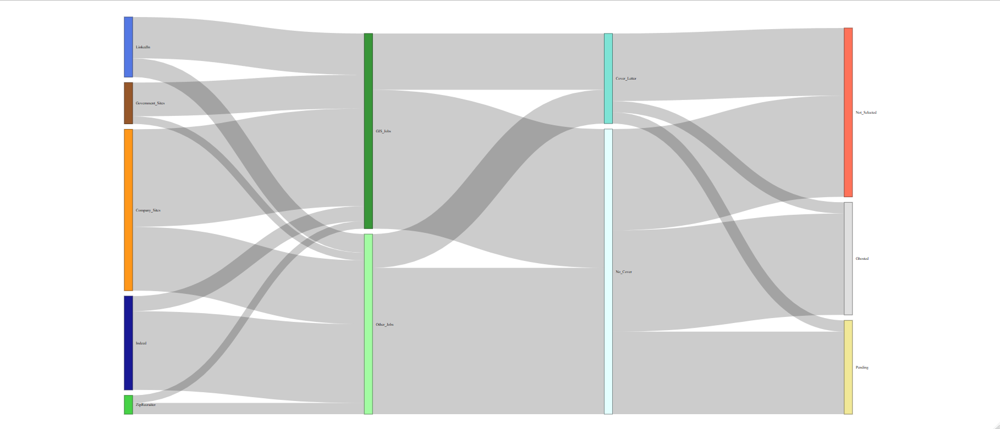

# My First Sankey Diagram
In honor of having applied to 100 jobs, I've turned the data I've collected 
about my job hunt into a Sankey Diagram.

I followed tutorials and code snippets from the [R Graph Gallery](https://r-graph-gallery.com/)
and just hard coded the data since it's a beginner project.

*Libraries*
* `networkD3`
* `dplyr`

## Output

## License
GNU General Public License v3.0